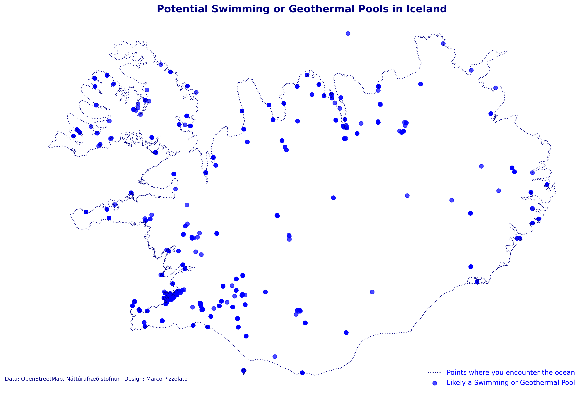

# 🌊 #30DayMapChallenge - Day 1: Points

**First map of the [#30DayMapChallenge](https://30daymapchallenge.com/) 2024, created for Náttúrufræðistofnun.**

---

### Overview
This map presents potential **swimming or bathing locations** across Iceland, represented with point data from **OpenStreetMap** and **IS 50V**. Using a **simple and clean point style**, it serves as a beginner-friendly introduction to mapping with Python, helping users become familiar with mapping tools and concepts.

### How to Use
Explore the map and experiment with its features. You’re encouraged to play around and create your own version as a way to practice your mapping skills.

---

### Attribution
- **License**: This notebook is published under **CC BY 4.0**.
- **Citation**: "*Credits: Náttúrufræðistofnun*"
- **Author**: Marco Pizzolato

| Run this code via free cloud platforms: |  |  |  |
|---|---|---|---|

