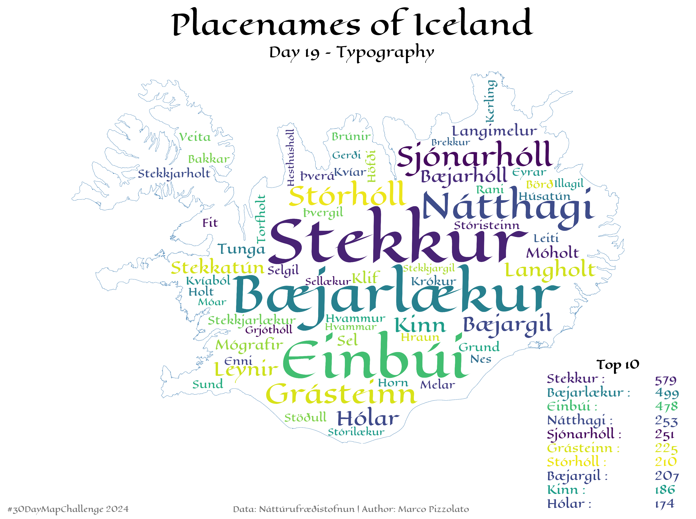

# ✍️ #30DayMapChallenge - Day 19: Typography

**Map for day 19 of the [#30DayMapChallenge](https://30daymapchallenge.com/) 2024 for Náttúrufræðistofnun**

---

| Try the code via free cloud platforms: |  |  |  |
|---|---|---|---|

 
### Íslenska
**Orðský – Algengustu örnefni á Íslandi**
 
Þetta kort sýnir algengustu örnefni á Íslandi í formi orðskýs. Kortið var búið til í Python með pakkann **WordCloud** og notar **Örnefni** og **Strandlínu** frá Náttúrufræðistofnun.  
 
Stærð orðanna endurspeglar hversu oft þau eru notuð – því stærra sem orðið er, því algengara er það. Þetta veitir innsýn í hvaða örnefni eru mest áberandi á Íslandi.
 
Hægt er að prófa að keyra verkefnið í **Kaggle** eða **Colab**.
 
**#Orðský #Ísland #Kortagerð #30DayMapChallenge #Typography**

---

### English
**Word Cloud – Top Icelandic Placenames**

This map visualizes Iceland’s most common placenames in the form of a word cloud. The map was created in Python using the **WordCloud** package and is based on **Örnefni** and **Strandlína** datasets from Náttúrufræðistofnun.  

The size of each word reflects its frequency – the larger the word, the more often it appears. This provides a fascinating perspective on the most prominent placenames in Iceland.  

Users can try out the examples themselves by running the project in **Kaggle** or **Colab**.  

**#WordCloud #Iceland #Mapping #30DayMapChallenge #Typography**

---

### Design Credits 
- **Author**: Marco Pizzolato
- **Font**: [Eagle Lake](https://fonts.google.com/specimen/Eagle+Lake)
- **Data Sources**: [Örnefni](https://gatt.natt.is/geonetwork/srv/ice/catalog.search#/metadata/AED93950-4043-4D42-B8F8-C118611F33C9) and [Strandlína](https://gatt.natt.is/geonetwork/srv/ice/catalog.search#/metadata/FE3E66F8-7749-409A-8795-02207CE27613) from Náttúrufræðistofnun
- **Created in**: Python with the [WordCloud](https://amueller.github.io/word_cloud/index.html) package by Andreas Mueller 

---

**License**: Creative Commons **CC BY 4.0**

---

This word cloud map provides a typographic exploration of Iceland’s placenames, blending data visualization with geographical storytelling.

 
