# 🌍 #30DayMapChallenge 2024 - Náttúrufræðistofnun

Welcome to the **#30DayMapChallenge** repository for **Náttúrufræðistofnun**. This repo contains code and maps created for the 2024 challenge, with the goal of sharing data and teaching others how to create quick and effective maps to visualize their work.

Find out more about the [#30DayMapChallenge](https://30daymapchallenge.com/).

---

## Repository Goals
The purpose of this repository is to:
- Share **data from Náttúrufræðistofnun**
- Provide tutorials on **simple mapping techniques**
- Help you learn to **create maps** that represent data in a clear and meaningful way

---

## License and Citation
- **License**: Creative Commons **CC BY 4.0**
- **Citation**: "Credit: Náttúrufræðistofnun"

---

## Daily Maps

Each day of the challenge presents a unique theme. Below, you can find links to each day’s map, along with a brief description.

| Day | Theme | Description | Image |
|-----|-------|-------------|-------|
| 1 | Points | A map using points to show individual locations—cities, trees, or more abstract concepts. Start simple with points! 📍 | 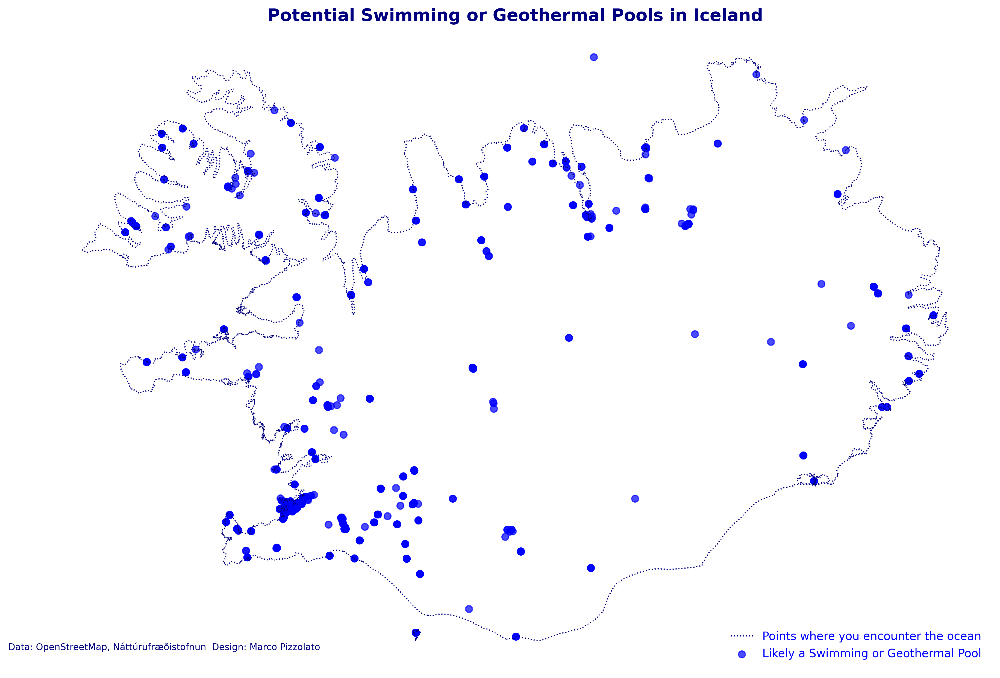 |
| 2 | Lines | A map with lines, focusing on connections or divisions like roads, rivers, and borders. Keep it flowing! 📏 | 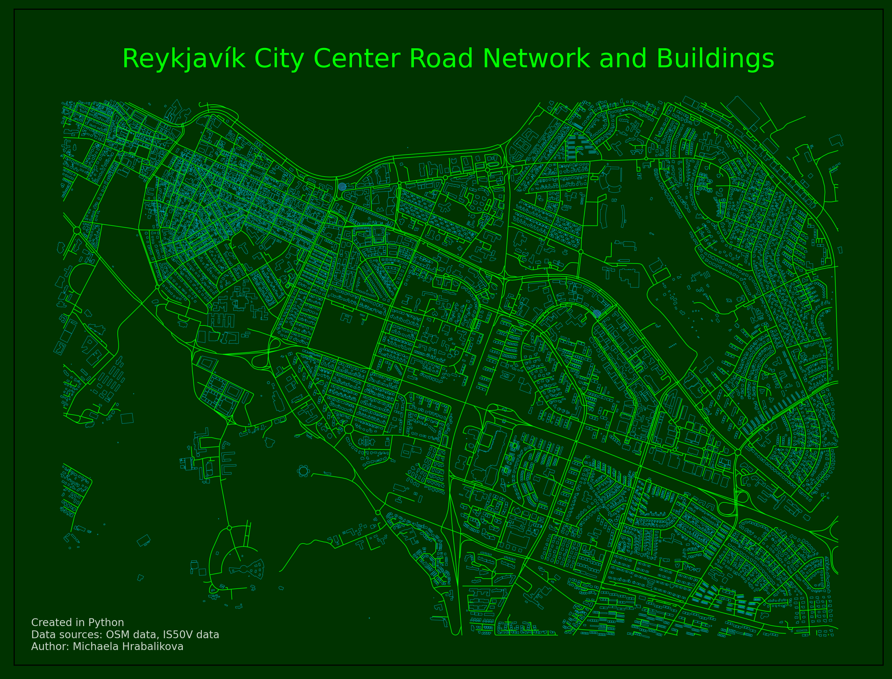 |
| 3 | Polygons | Use polygons to represent regions or defined shapes, like countries or lakes. 🛑 |  |
| 4 | Hexagons | Visualize spatial patterns with hexagonal grids, a fun twist on density mapping. 🔷 |  |
| 5 | A journey | Map any journey, tracing movement from one place to another. 🚶‍♂️✈️ |  |
| 6 | Raster | Focus on grids and pixels, showcasing raster data like satellite imagery or heatmaps. 🟦🟧 |  |
| 7 | Vintage style | Create a vintage-style map, using classic elements to map something modern. 🕰️🗺️ | 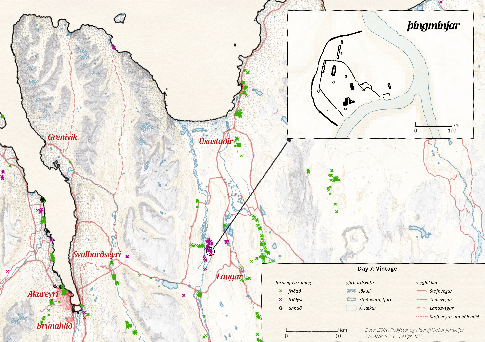 |
| 8 | Humanitarian Data Exchange (HDX) | Map humanitarian topics using data from HDX, focusing on social good. 🌍🚑 | [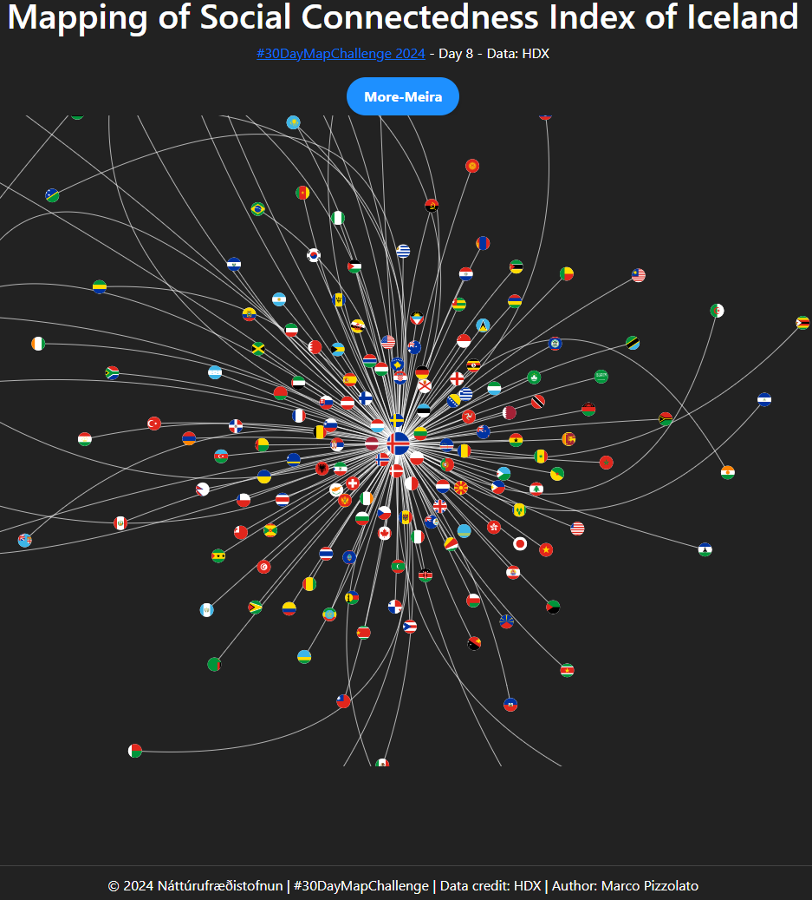](https://m-lmi.github.io/30DayMapChallenge/Day-8/index.html) |
| 9 | AI only | Use AI tools like DALL-E or ChatGPT to generate map content. Challenge prompt creativity! | 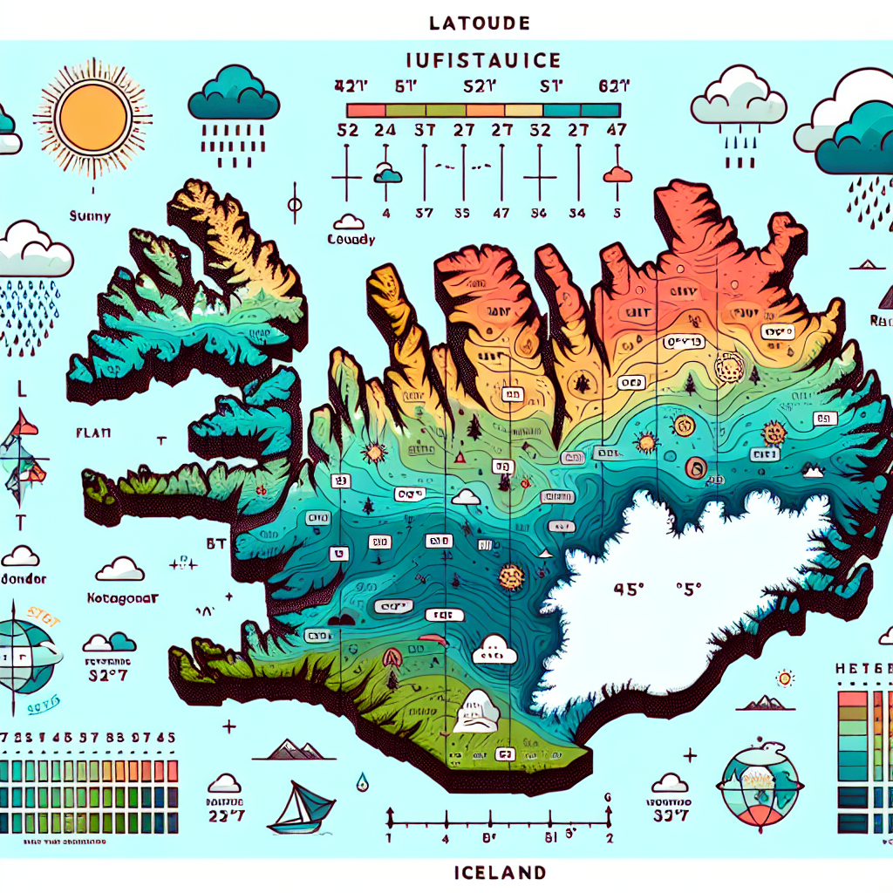 |
| 10 | Pen & paper | Go analog with a hand-drawn map. It’s about the creative process! ✏️🗺️ | 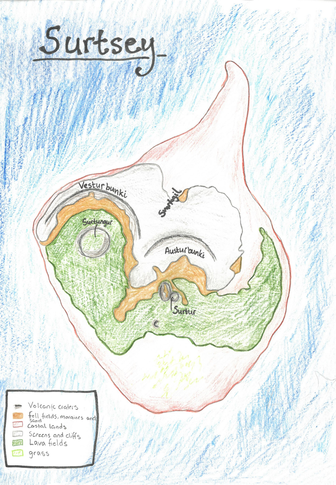 |
| 11 | Arctic | Focus on the Arctic, mapping ice coverage, habitats, or climate change. ❄️🧊 | 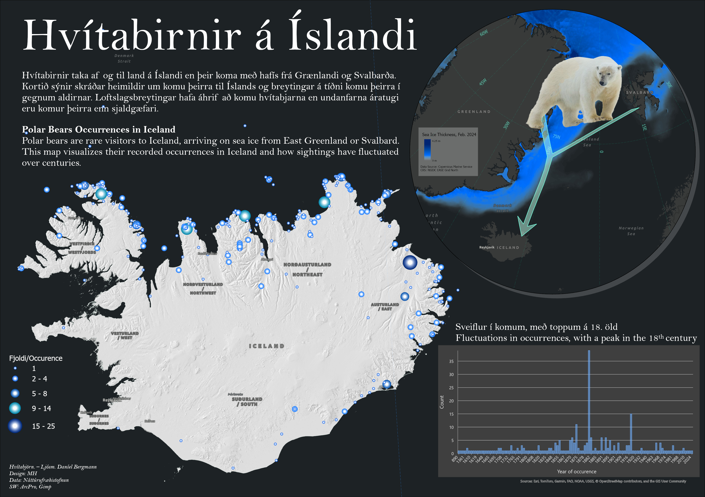 |
| 12 | Time and space | Show the relationship between time and geography with a time-focused map. ⏳🌍 |  |
| 13 | A new tool | Try a new tool, software, or technique for mapping. The challenge is to experiment! 🧪🔧 | 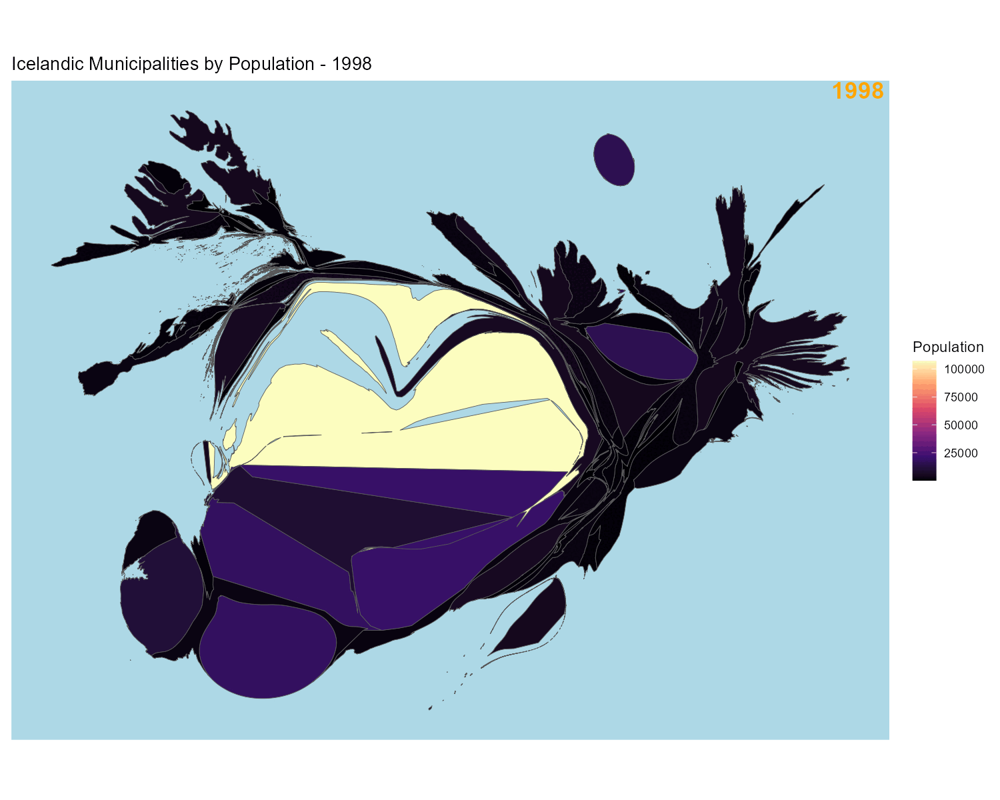 |
| 14 | A world map | Map the whole world, focusing on continents, ecosystems, or oceans. 🌍 |  |
| 15 | My data | Make it personal by mapping data from your own life. 🗒️ |  |
| 16 | Choropleth | Use color to show data variation across regions with a classic choropleth map. 🎨 | 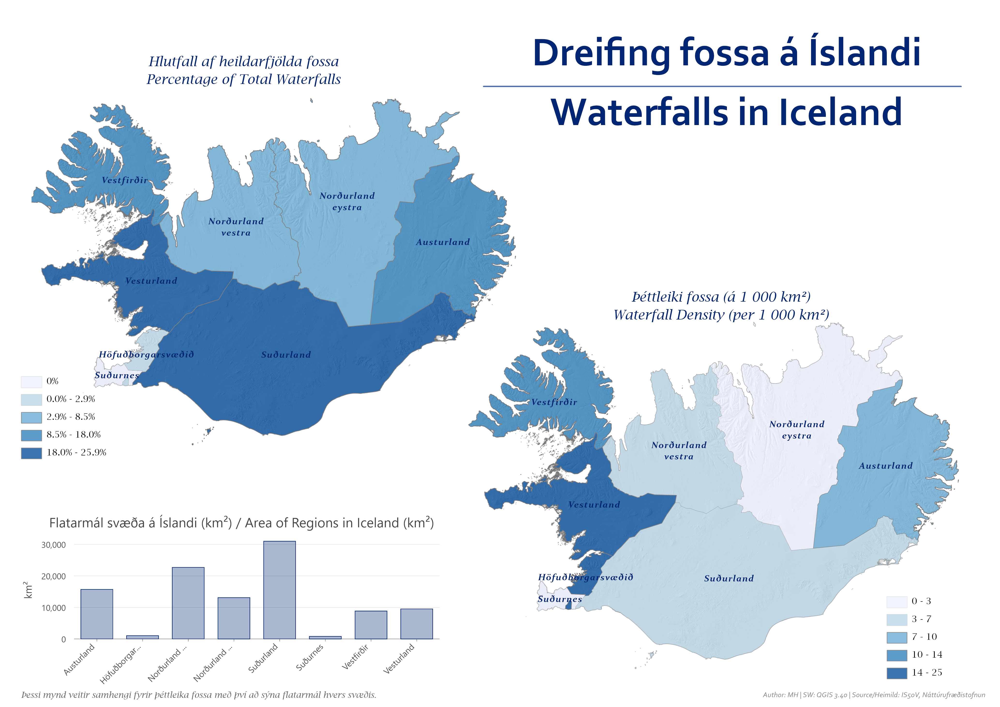 |
| 17 | Collaborative map | Collaborate with others to create a single map. 🤝🗺️ | 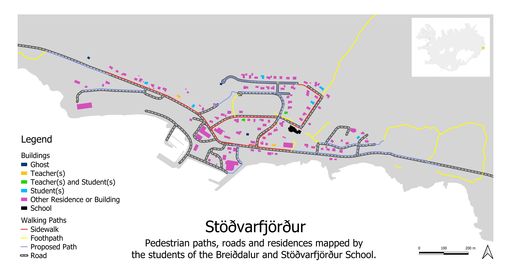 |
| 18 | 3D | Add depth by mapping in 3D, showcasing elevation or structures. 🎢🏔️ |  | 
| 19 | Typography | Let text do the work with a typography-focused map. ✍️🅰️ | 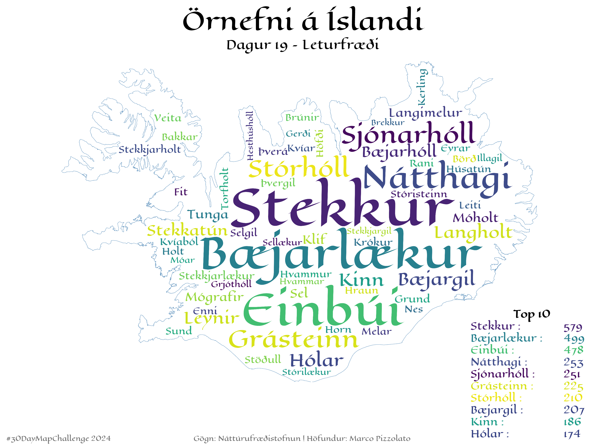 |
| 20 | OpenStreetMap | Use OpenStreetMap data to create a map. 🗺️📍 |  |
| 21 | Conflict | Map a conflict, highlighting boundaries, tensions, or outcomes. ⚔️🛑 | 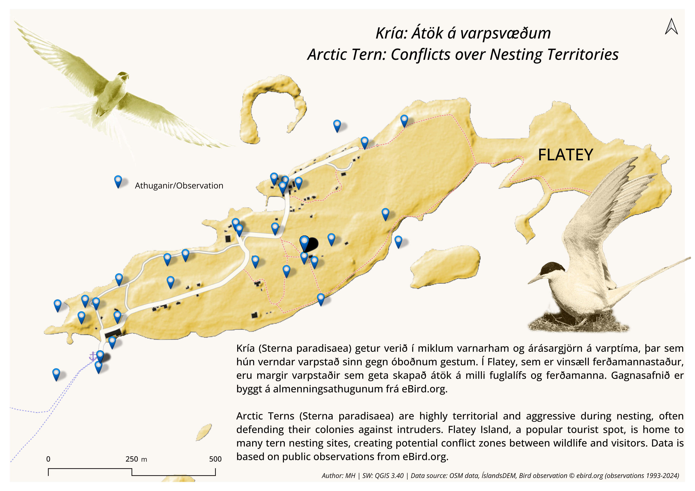 |
| 22 | 2 colours | Restrict yourself to only 2 colors for a minimalist map. |  |
| 23 | Memory | Map a place from memory—no need for accuracy, just creativity! 💭🗺️ |  |
| 24 | Only circular shapes | Stick to circular shapes for a unique mapping approach. 🔵⭕ |  |
| 25 | Heat | Map something related to heat, like temperature or intensity areas. 🔥🌡️ |  |
| 26 | Map projections | Play with map projections, from Mercator to Butterfly. |  |
| 27 | Micromapping | Zoom in to map something small and detailed. 🧐🔍 |  |
| 28 | The blue planet | Focus on water—oceans, rivers, or lakes. 🌊🐋 |  |
| 29 | Overture | Use data from the Overture Maps Foundation for a fresh perspective. 🌍📊 | 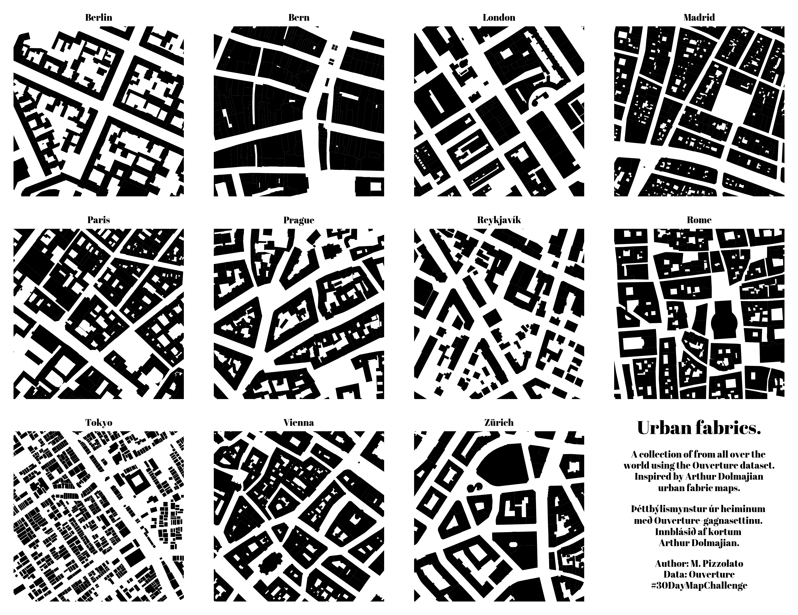 |
| 30 | The final map | Finish strong with any map you choose! Celebrate your creativity. 🎉🌐 |  |

---

Happy Mapping! 🎉 Each day’s map explores a new technique or theme, offering fresh ways to visualize data and tell a story through maps. We hope this repository inspires you to dive into mapping and experiment with different styles and data sources.